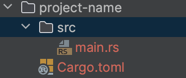

## 创建新项目
```shell
cargo new project-name
```
项目名称不能包括非 ASCII 字符，例如中文（Support for non-ASCII crate names is experimental and only valid on the nightly toolchain. 传递）



Cargo.toml 文件： 
```toml
#
[package]
name = "project-name"
version = "0.1.0"
edition = "2021"

# See more keys and their definitions at https://doc.rust-lang.org/cargo/reference/manifest.html

[dependencies]
# crates
```
main.rs：
```rust
fn main() {
    println!("Hello, world!");
}
```
## 构建项目
```shell
cargo build
```
输出如下：
```text
/Users/coderknock/.cargo/bin/cargo build --color=always --message-format=json-diagnostic-rendered-ansi
   Compiling lean-rust v0.1.0 (/Users/coderknock/IdeaProjects/learn-rust)
    Finished dev [unoptimized + debuginfo] target(s) in 0.31s
```
此命令在 `target/debug` 而不是当前目录创建可执行文件

```shell
cargo build --release
```
优化构建
```text
/Users/coderknock/.cargo/bin/cargo build --color=always --message-format=json-diagnostic-rendered-ansi --release
   Compiling lean-rust v0.1.0 (/Users/coderknock/IdeaProjects/learn-rust)
    Finished release [optimized] target(s) in 0.13s
```

## 运行项目
```shell
cargo run
```
输出内容：
```text
/Users/coderknock/.cargo/bin/cargo run --color=always
    Finished dev [unoptimized + debuginfo] target(s) in 0.00s
     Running `/Users/coderknock/IdeaProjects/learn-rust/target/debug/lean-rust`
Hello, world!
```
一步生成可执行文件并运行
## 检查代码
```shell
cargo check
```
运行结果：
```text
/Users/coderknock/.cargo/bin/cargo check --color=always --message-format=json-diagnostic-rendered-ansi
    Checking lean-rust v0.1.0 (/Users/coderknock/IdeaProjects/learn-rust)
    Finished dev [unoptimized + debuginfo] target(s) in 0.18s

```
在不生成二进制文件的情况下构建项目【比较快】
## cargo 另一个有点：不同平台统一
## 文档地址 doc.rust-lang.org/cargo